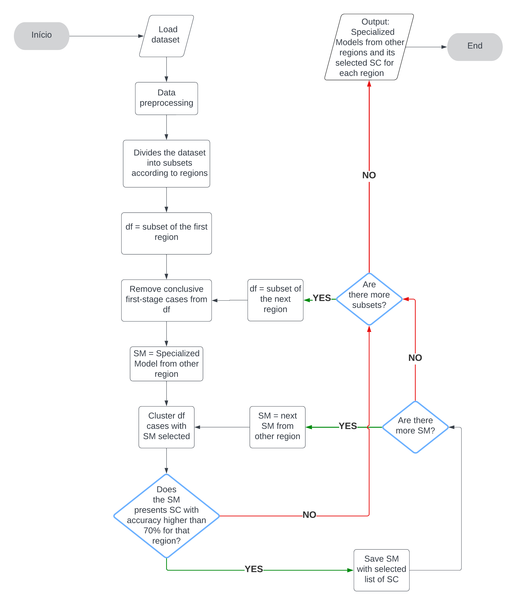
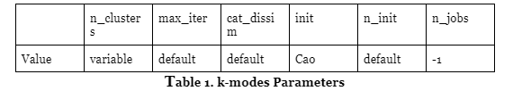

# UDF a k-modes Based Algorithm to Reduce Unproductive Displacement of Power Utility Teams

## Flowcharts

### Predictions

    

### First Stage Training

    

### Second Stage Training

    

## Tables

### K-Modes Parameters

    

### Time Spent on Training

    

### Time Spent on Validation

    

